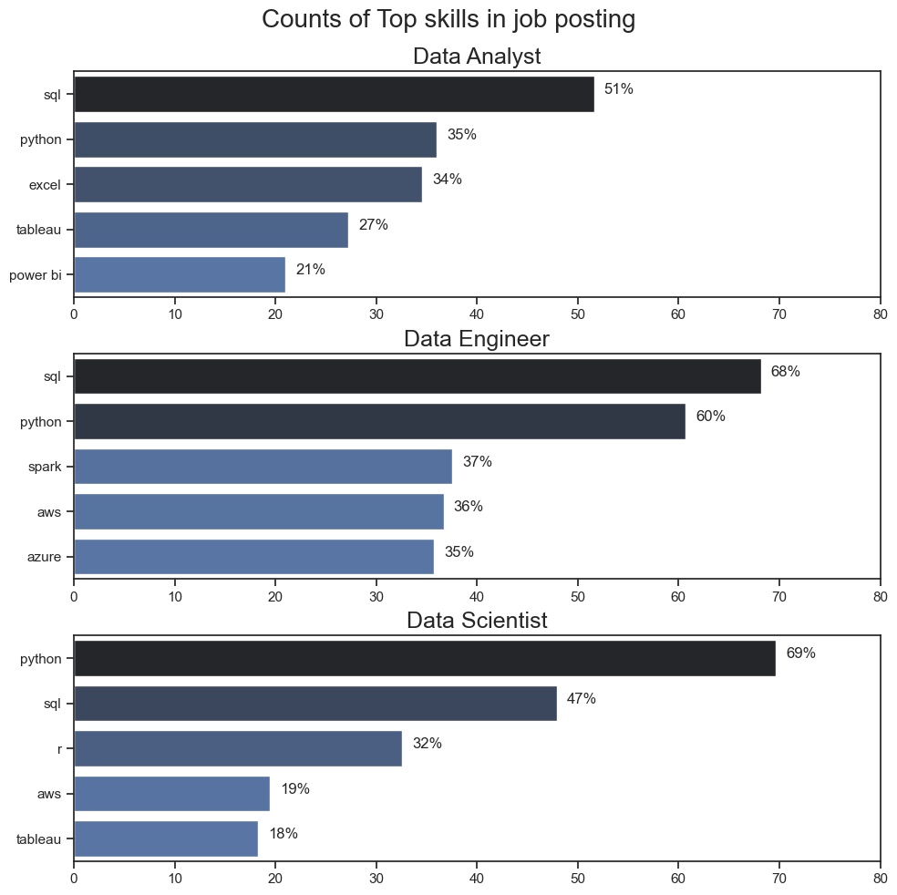
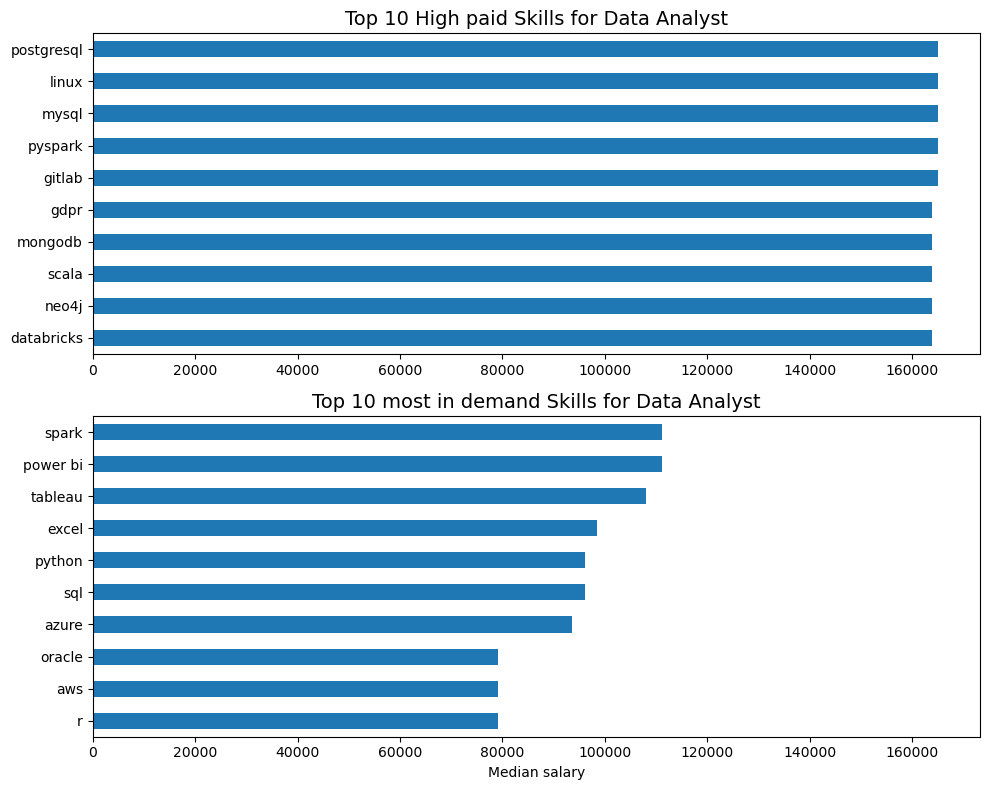
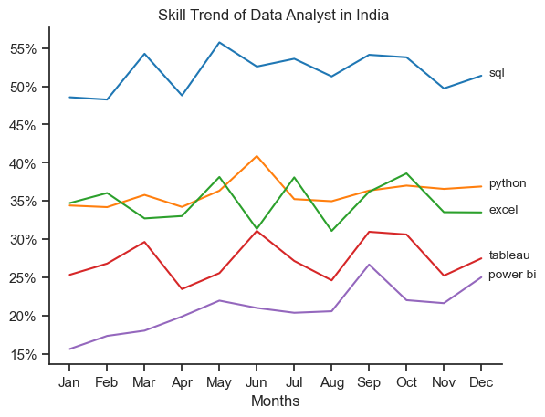
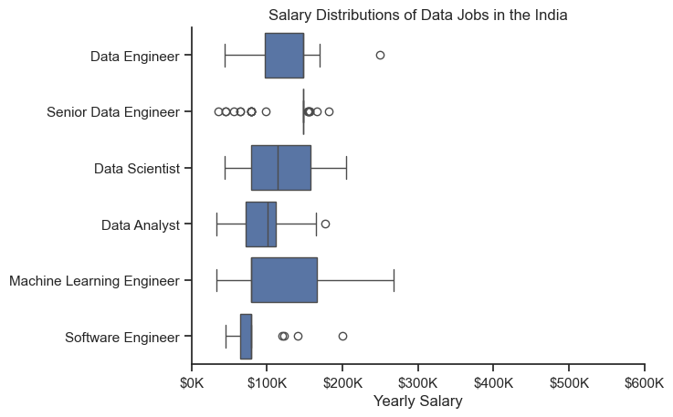

# India Data Analyst Job Market Analysis: Skill Demand & Salary Insights

[](https://www.python.org/)
[](https://pandas.pydata.org/)
[](https://numpy.org/)
[](https://matplotlib.org/)
[](https://seaborn.pydata.org/)
[](https://jupyter.org/)

---

## 🎯 Project Overview

Navigating the job market as a Data Analyst can feel overwhelming. Which skills should you invest your time in learning? Do the most popular tools actually pay the highest salaries, or are niche skills yielding better returns?

This project analyzes real-world job posting data for **Data Analyst positions in India** using the dataset from Hugging Face. By evaluating thousands of job listings, this project compares:
- **Skill Demand**: The most frequently requested tools and technologies in Indian job listings.
- **Skill Compensation**: The median annual salary associated with specific skills.

---

## 💡 Key Findings & Highlights

1. **Demand vs. Salary Split**: High-demand baseline tools (like SQL and Excel) are essential prerequisites for getting hired, but specialized stack tools (e.g., advanced cloud technologies, specialized database/analytics frameworks) often command higher median compensation.
2. **Core Essentials**: SQL and Python remain the top foundational tech stack required across the vast majority of Indian Data Analyst postings.
3. **Data Visualization Standard**: Visualization tools like Tableau and Power BI show heavy listing volume, making dashboarding a non-negotiable skill.

---

## Project Visualisation
### Top 5 Highest Paying Skills


### TOP 10 high paid skills and Most In-Demand Skills for Data Analyst



### Skill Trend of Data Analyst in India



### Salary Distributions of Data Jobs in the India



---

## 🛠️ Tech Stack & Libraries

- **Language:** Python 3.x
- **Data Manipulation:** `pandas`, `ast`
- **Data Acquisition:** `datasets` (Hugging Face Datasets API)
- **Data Visualization:** `matplotlib`, `seaborn`

---

## 🚀 Getting Started

### 1. Prerequisites
Ensure you have Python 3.8 or above installed on your machine.

### 2. Installation
Clone the repository and install the required dependencies:

```bash
git clone https://github.com/your-username/data-analyst-job-market-india.git
cd data-analyst-job-market-india
pip install pandas matplotlib seaborn datasets
```

### 3. Running the Notebook
Launch Jupyter Notebook or JupyterLab to run the analysis:

```bash
jupyter notebook
```
Open `data_analysis.ipynb` (or your respective notebook file) and run all cells sequentially.

---

## 🔬 Methodology & Workflow

The analysis pipeline follows these steps:

1. **Data Ingestion**: Fetch raw data directly from Hugging Face's `lukebarousse/data_jobs` split.
2. **Data Cleaning & Filtering**:
   - Parse stringified list objects in `job_skills` safely using `ast.literal_eval`.
   - Filter down specifically to `job_title_short == 'Data Analyst'` and `job_country == 'India'`.
   - Remove missing values for salary analysis (`salary_year_avg.dropna()`).
3. **Data Transformation**:
   - Use Pandas `.explode('job_skills')` to unnest skill arrays into clean tabular format.
4. **Aggregation**:
   - Calculate skill frequency counts (`.count()`).
   - Calculate median annual salary per skill (`.median()`).
5. **Visualization**:
   - Generate dual bar charts comparing **Top 10 Most Demanded Skills** side-by-side with **Top 10 Highest Paying Skills**.

---

## 📈 Visualizing the Insights

Here is the Python visualization snippet used to create the side-by-side comparison charts:

```python
import matplotlib.pyplot as plt
import seaborn as sns

# Set visual style
sns.set_theme(style="whitegrid")

fig, axes = plt.subplots(1, 2, figsize=(15, 6))

# Chart 1: Top 10 Highest Paying Skills
sns.barplot(
    x='median', 
    y=df_da_top_pay.index, 
    data=df_da_top_pay, 
    ax=axes[0], 
    palette='Greens_r'
)
axes[0].set_title('Top 10 Highest Paying Skills (Data Analyst - India)', fontsize=13, fontweight='bold')
axes[0].set_xlabel('Median Yearly Salary (USD)', fontsize=11)
axes[0].set_ylabel('Skills', fontsize=11)

# Chart 2: Top 10 Most Demanded Skills
sns.barplot(
    x='count', 
    y=df_da_skills.index, 
    data=df_da_skills, 
    ax=axes[1], 
    palette='Blues_r'
)
axes[1].set_title('Top 10 Most In-Demand Skills (Data Analyst - India)', fontsize=13, fontweight='bold')
axes[1].set_xlabel('Number of Job Postings', fontsize=11)
axes[1].set_ylabel('Skills', fontsize=11)

plt.tight_layout()
plt.show()
```

---

## 📌 Future Roadmap

- [ ] Add time-series analysis to track skill demand trends month-over-month.
- [ ] Expand analysis to include Data Engineer and Data Scientist roles for cross-role comparison.
- [ ] Implement remote vs. on-site salary differential analysis.

---

This project demonstrates data cleaning, exploratory data analysis, aggregation, and visualization using Python, providing insights into the Indian Data Analyst job market and the relationship between skill demand and salary.

